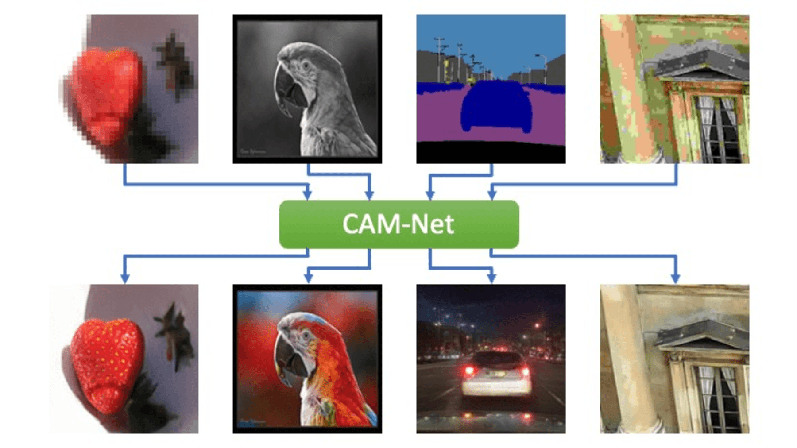

# CAM-Net: Hyper-Resolution Implicit Model

[Project Page][project] | [Paper][paper] | [Pre-trained Models](/experiments/pretrained_models)

PyTorch implementation of CAM-Net: a unified architecture for multimodal conditional image synthesis.
CAM-Net is able to:

- (Colorization) Automatic colorizing a grayscale image
- (Super-Resolution) Increase the width and height of images by a factor of 16x
- (Image-Synthesis) Generating diverse images from semantic layouts
- (Decompression) Recover a plausible image from a heavily compressed image


## Dependencies and Installation

- Python 3.8
- [PyTorch >= 1.5](https://pytorch.org)
- NVIDIA GPU + [CUDA >= 10.2](https://developer.nvidia.com/cuda-downloads)

To get started, please run the following command:
```sh
$ git clone --recursive https://github.com/niopeng/CAM-Net.git
```

[Optional] To set up using pip, please run the following command:
```sh
$ pip install -r requirements.txt
```
[Optional] To set up using Anaconda, first replace the path you want to install the environment in the cam_net_env.yml file (in the last line "prefix").
Then, do the following:
```sh
$ conda env create -f cam_net_env.yml
$ conda activate cam-net-env
```
Note that the provided yml file would install Pytorch 1.8 with CUDA 11.1 by default.

[Required For Training] The training code uses [DCI CUDA][dci], to set up:
```sh
$ cd ./code/dciknn_cuda
$ python setup.py install
```

## Training and Testing
Please run the following steps:
1. Prepare datasets. Details can be found [here](/code/data).
2. Change config files located under [options](/code/options).
3. [Optional] Load [pre-trained models](/experiments/pretrained_models).
4. Run training/testing commands:
```sh
// Training
$ python train.py -opt options/train/train_[task].json
// Testing
$ python test.py -opt options/test/test_[task].json
```
Note: Training a CAM-Net model for 16x super-resolution, Colorization, and Image-Synthesis requires 32GB of GPU memory, but testing only requires 16GB of GPU memory.


## Code Organization
The code consists of the following components:
- `data/`: Dataset/Dataloader definition and useful tools
- `dciknn_cuda/`: Fast k-Nearest Neighbour Search (DCI) interface
- `models/`: Defines CAM-Net model, architecture and [Leanred Perceptual Similarity (LPIPS)](https://github.com/richzhang/PerceptualSimilarity) loss
- `options/`: Training/Testing configurations
- `utils/`: Basic utlility functions, logger and progress bar
- `sampler.py`: Sampling process for conditional IMLE mentioned in our [paper][paper]
- `train.py`: Main training script
- `test.py`: Main testing script

[project]:https://niopeng.github.io/CAM-Net/
[paper]: https://arxiv.org/abs/2106.09015
[pretrain]: https://github.com/niopeng/CAM-Net/tree/main/experiments/pretrained_models
[options]:https://github.com/niopeng/CAM-Net/tree/main/code/options
[data]:https://github.com/niopeng/CAM-Net/tree/main/code/data
[dci]:https://github.com/niopeng/dciknn_cuda
